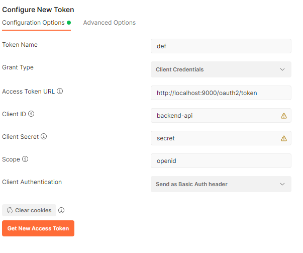

# cookbook-auth-usr

Backend application user authentication

# Intro

Application provides handles user authentication and registration.

# Response format


# Dependencies


## Postgresql

It is used as main database for writing/reading data. If database is not available, application will stop running.

## backend-api application

It is used for creating authors after successful user registration.


TODO

# API documentation

TODO: swagger doc

# Security

jwt ...

## Get access token using Postman

To get access token, under _Authorization_ select _Oauth 2.0_ and then configure values according to the client you are
using and press _Get New Access Token_. Following image shows some example values:



# Rate limits

TODO... define them etc

# Local setup

To run application locally, firstly you need to setup environment. For that, there is _docker-compose.yml_ in the root
project.

You need Tomcat 9 with Postgres driver in its _lib_ folder.

Create new Tomcat Configuration in idea. Copy following to VM parameters:

```
-ea -DCOOKBOOK_DATABASE_SCHEMA=cookbook -DCOOKBOOK_POSTGRES_JDBC_URL=jdbc:postgresql://localhost:5432/cookbook -DCOOKBOOK_POSTGRES_USERNAME=cookbook -DCOOKBOOK_POSTGRES_PASSWORD=cookbook
-DOAUTH2_DATABASE_SCHEMA=oauth2 -DOAUTH2_POSTGRES_JDBC_URL=jdbc:postgresql://localhost:5432/cookbook -DOAUTH2_POSTGRES_USERNAME=cookbook -DOAUTH2_POSTGRES_PASSWORD=cookbook
-DGOOGLE_CLIENT_ID=<generated_id> -DGOOGLE_CLIENT_SECRET=<generated_secret>
```

Tomcat port should be set to `9000`.

# Tests

By default, only unit test are running in maven lifecycle. Integration and acceptance tests are separated from that
lifecycle and are called using maven profiles.

All tests must have the __tag__ which is used as group by surefire and failsafe maven plugins.

Every class must have at least 90% coverage, otherwise build will fail. If you need to exclude some class from coverage,
add it to the jaccoco exclusion list.
(Jaccoco is only checking coverage for unit tests).

## Unit tests

- in default maven `test` directory
- tagged with __UnitTest__
- follow maven naming convention (in this case, all test end with suffix _Test_)

## Integration tests

- in separate directory called `integration-test`
- they are using Docker, so they can be only run on machine with docker support
- follow maven naming convention (in this case, all test end with suffix _IT_)
- use test containers for any dependency
- run with `mvn clean verify -P integration-test`
- you can run test in IDEA the same way as unit tests

## Acceptance Tests

- in separate directory called `integration-test` under package `acceptance`
- Cucumber as testing framework
- run with `mvn clean verify -P acceptance-test -Dpostgres_jdbc_url=...`
- to run them from IDEA you need to use `AcceptanceTestRunner` class and provide needed VM variables.

To run acceptance tests, you need to provide following system properties: